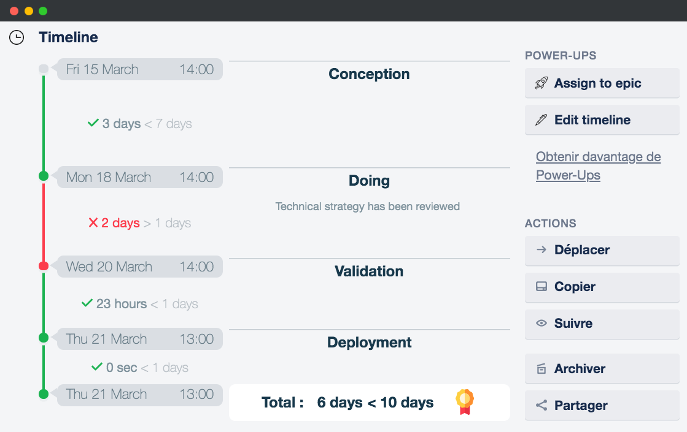
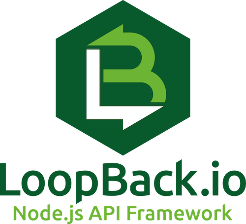
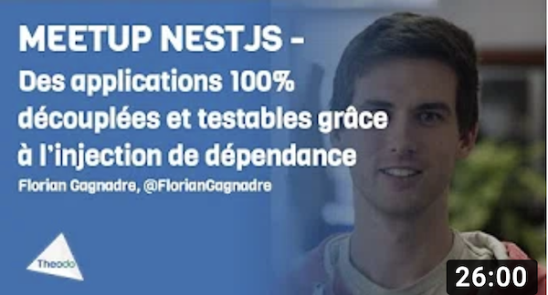

import {
  CodeSurferColumnLayout,
  Step,
  Code,
  nightOwl as hooksTheme,
} from "code-surfer";
export { vsDarkFull as theme } from "code-surfer";
import GreetingLoader from "./src/greeting-loader";
import { Appear, Image, Notes } from "mdx-deck";
import { Split } from "mdx-deck/layouts";

# Flash : from Express to Nest

Sharing a js adventure based on a true story

<Notes>
  Petit intro, je dis qui je suis, je me présente
</Notes>

---

<Split>

  

  ### Frédéric Barthelet

  Architect developer @ Theodo

  Twitter: @bartheletf
  
  Github: @fredericbarthelet

</Split>

<Notes>
  IoT and connected object enthousiast
  NodeJS experience : Express & Loopback
  Big PHP background experience. Symfony lover
</Notes>

---

A bit of context...

---

<Split>

  

  ### Trello

  Collaborative list & card based online organizer app

  https://trello.com

</Split>

---

<Split>

  

  ### Flash

  <ul style={{ listStyleType: "none" }}>
    <li>Flash is part of Trello ecosystem</li>
    <li>Empowers user to track their leadtime</li>
  </ul>

  https://www.usefla.sh

</Split>

<Notes>
  Express + Glitch
</Notes>

---

---

# Architecture

Proxy

💻  ⚡️ 💻

---

  <h3>🛰️ Trello API</h3>

  <h3>⚡️ Flash</h3>

  <h3> 💻 Trello web application</h3>

---

Let's start developing...

---

### 🏃‍ Express (vanilla) + Glitch

---

<CodeSurferColumnLayout sizes={[1]}>
  <Step subtitle="Starting simple">
    <Code
      code={
        require("!!raw-loader!./src/flash.glitch.1.1.js")
          .default
      }
      lang="js"
    />
    <Notes>
      Première version de l'app
    </Notes>
  </Step>
  <Step subtitle="Contacting trello API">
    <Code
      code={
        require("!!raw-loader!./src/flash.glitch.1.2.js")
          .default
      }
      lang="js"
    />
    <Notes>
      Cum cu cetero option utroque. Ex duo velit ponderum,
      iisque mnesarchum ex est, te quem consul recteque his.
      Mei ut postea diceret accumsan.
    </Notes>
  </Step>
  <Step subtitle="Formating result and handling errors">
    <Code
      code={
        require("!!raw-loader!./src/flash.glitch.1.3.js")
          .default
      }
      lang="js"
    />
    <Notes>
      Cum cu cetero option utroque. Ex duo velit ponderum,
      iisque mnesarchum ex est, te quem consul recteque his.
      Mei ut postea diceret accumsan.
    </Notes>
  </Step>
  <Step subtitle="Writting data processing logic">
    <Code
      code={
        require("!!raw-loader!./src/flash.glitch.1.4.js")
          .default
      }
      lang="js"
    />
    <Notes>
      Cum cu cetero option utroque. Ex duo velit ponderum,
      iisque mnesarchum ex est, te quem consul recteque his.
      Mei ut postea diceret accumsan.
    </Notes>
  </Step>
  <Step subtitle="First fonctionnal endpoint">
    <Code
      code={
        require("!!raw-loader!./src/flash.glitch.1.4.js")
          .default
      }
      lang="js"
      focus="1:71"
    />
    <Notes>
      Cum cu cetero option utroque. Ex duo velit ponderum,
      iisque mnesarchum ex est, te quem consul recteque his.
      Mei ut postea diceret accumsan.
    </Notes>
  </Step>
</CodeSurferColumnLayout>

---

# Flash was born

---

## 3 months later...

<ul style={{ listStyleType: "none" }}>
  <Appear>
    <li>😀 - ⬆️ Increased traffic</li>
    <li>😄 - 🆕 Additional features requested</li>
    <li>😃 - 👨‍💻 New developers onboarded in the team</li>
    <li>😐 - 📗 No development standards</li>
    <li>😖 - 🖨️ No feedback on API consumption and error rates</li>
    <li>😢 - 🔧 Poor code maintanibility</li>
    <li>😭 - 🐛 Bug reports increasing</li>
  </Appear>
</ul>

---

Prototyping does not enforce code quality and maintanibility

---

It's time to evolve

---

## Requirements

<ul style={{ listStyleType: "none" }}>
  <Appear>
    <li>Stay in NodeJS environement</li>
    <li>Find substitutes for features and patterns I love in Symfony</li>
    <li>--- DI container</li>
    <li>--- Request scoped context</li>
    <li>--- Annotation like code enhancement</li>
  </Appear>
</ul>

---

Stay in NodeJS environement

---

Stay in NodeJS environement

---

Topics I would like to share

---

Scoped dependancy injection

Request decorators

---

<CodeSurferColumnLayout sizes={[1]}>
  <Step subtitle="Service architecture">
    <Code
      code={
        require("!!raw-loader!./src/flash.nest.problem.1.1.ts")
          .default
      }
      lang="ts"
    />
    <Notes>
      Première version de l'app
    </Notes>
  </Step>
  <Step>
    <Code
      code={
        require("!!raw-loader!./src/flash.nest.problem.1.1.ts")
          .default
      }
      lang="js"
      focus="3,9,15,21"
    />
    <Notes>
      Cum cu cetero option utroque. Ex duo velit ponderum,
      iisque mnesarchum ex est, te quem consul recteque his.
      Mei ut postea diceret accumsan.
    </Notes>
  </Step>
  <Step>
    <Code
      code={
        require("!!raw-loader!./src/flash.nest.problem.1.2.ts")
          .default
      }
      lang="js"
    />
    <Notes>
      Cum cu cetero option utroque. Ex duo velit ponderum,
      iisque mnesarchum ex est, te quem consul recteque his.
      Mei ut postea diceret accumsan.
    </Notes>
  </Step>
  <Step>
    <Code
      code={
        require("!!raw-loader!./src/flash.nest.problem.1.2.ts")
          .default
      }
      lang="js"
      focus="22"
    />
    <Notes>
      Cum cu cetero option utroque. Ex duo velit ponderum,
      iisque mnesarchum ex est, te quem consul recteque his.
      Mei ut postea diceret accumsan.
    </Notes>
  </Step>
</CodeSurferColumnLayout>

---

Scoped dependancy injection

---

NestJS DI 101

https://www.youtube.com/watch?v=UZeWc-UZy2k

---

<CodeSurferColumnLayout sizes={[1]}>
  <Step>
    <Code
      code={
        require("!!raw-loader!./src/flash.nest.di.1.1.ts")
          .default
      }
      lang="ts"
    />
    <Notes>
      Première version de l'app
    </Notes>
  </Step>
  <Step>
    <Code
      code={
        require("!!raw-loader!./src/flash.nest.di.1.2.ts")
          .default
      }
      lang="ts"
    />
    <Notes>
      Première version de l'app
    </Notes>
  </Step>
  <Step>
    <Code
      code={
        require("!!raw-loader!./src/flash.nest.di.1.3.ts")
          .default
      }
      lang="ts"
    />
    <Notes>
      Première version de l'app
    </Notes>
  </Step>
  <Step>
    <Code
      code={
        require("!!raw-loader!./src/flash.nest.di.1.4.ts")
          .default
      }
      lang="ts"
    />
    <Notes>
      Première version de l'app
    </Notes>
  </Step>
  <Step>
    <Code
      code={
        require("!!raw-loader!./src/flash.nest.di.1.5.ts")
          .default
      }
      lang="ts"
    />
    <Notes>
      Première version de l'app
    </Notes>
  </Step>
  <Step>
    <Code
      code={
        require("!!raw-loader!./src/flash.nest.di.1.6.ts")
          .default
      }
      lang="ts"
    />
    <Notes>
      Première version de l'app
    </Notes>
  </Step>
  <Step>
    <Code
      code={
        require("!!raw-loader!./src/flash.nest.di.1.7.ts")
          .default
      }
      lang="ts"
    />
    <Notes>
      Première version de l'app
    </Notes>
  </Step>
  <Step>
    <Code
      code={
        require("!!raw-loader!./src/flash.nest.di.1.8.ts")
          .default
      }
      lang="ts"
      focus="7:9"
    />
    <Notes>
      Première version de l'app
    </Notes>
  </Step>
  <Step>
    <Code
      code={
        require("!!raw-loader!./src/flash.nest.di.1.9.ts")
          .default
      }
      lang="ts"
      focus="7"
    />
    <Notes>
      Première version de l'app
    </Notes>
  </Step>
</CodeSurferColumnLayout>

---

Custom decorator

---

<CodeSurferColumnLayout sizes={[1]}>
  <Step>
    <Code
      code={
        require("!!raw-loader!./src/flash.nest.di.1.9.ts")
          .default
      }
      lang="ts"
      focus="14,16"
    />
    <Notes>
      Première version de l'app
    </Notes>
  </Step>
  <Step>
    <Code
      code={
        require("!!raw-loader!./src/flash.nest.di.1.10.ts")
          .default
      }
      lang="ts"
    />
    <Notes>
      Première version de l'app
    </Notes>
  </Step>
  <Step>
    <Code
      code={
        require("!!raw-loader!./src/flash.nest.decorator.1.1.ts")
          .default
      }
      lang="ts"
    />
    <Notes>
      Première version de l'app
    </Notes>
  </Step>
  <Step>
    <Code
      code={
        require("!!raw-loader!./src/flash.nest.decorator.2.1.ts")
          .default
      }
      lang="ts"
    />
    <Notes>
      Première version de l'app
    </Notes>
  </Step>
  <Step>
    <Code
      code={
        require("!!raw-loader!./src/flash.nest.decorator.3.1.ts")
          .default
      }
      lang="ts"
    />
    <Notes>
      Première version de l'app
    </Notes>
  </Step>
</CodeSurferColumnLayout>

---

# What I love

😍 I love request injection 😍

<Notes>
  Affected performence is not an issue. My big perf issue is on Trello API side.
</Notes>

---

# What I love

😍 I love decorators 😍

---

# What I love

😍 I love nest-cli 😍

---

https://github.com/fredericbarthelet/nestjs-migration

---

# Thank you

---